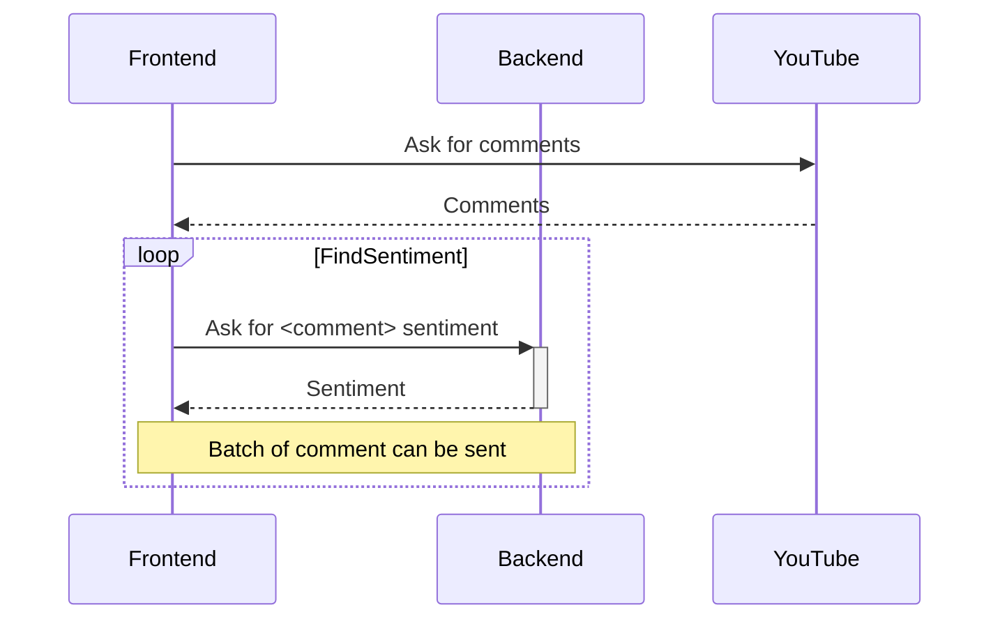

# Emotion detection from text

This is the repo storing work for the big assignment from the Intelligent Systems course (CO5134),
semester 241.

The specific field that the group has decided on is "Emotion detection from text" (sentiment
analysis) with Naive Bayes model. The application will be sentiment analysis tool for YouTube
comment section from a video.

## Thus far, the group has worked/decided on

- Reading some paper for inspiration
    1. Sentiment Analysis on Twitter Data-set using Naive Bayes Algorithm
    2. Real Time Sentiment Analysis of Tweets Using Naive Bayes
    3. Multinomial Naive Bayes Classification Model for Sentiment Analysis
    4. A Survey of Sentiment Analysis: Approaches, Datasets, and Future Research
- Finding some datasets in VN and EN
  - (VN) <https://streetcodevn.com/blog/dataset>
  - (VN) UIT-VSFC <https://sites.google.com/uit.edu.vn/uit-nlp/datasets>
  - (EN) Sentiment140 dataset (<https://www.kaggle.com/datasets/kazanova/sentiment140>)
  - (EN) IMDB movie reviews dataset (<https://www.kaggle.com/datasets/lakshmi25npathi/imdb-dataset-of-50k-movie-reviews>)
- Application's feature set
  - Users are able to reclassify a comment. This new reclassification will be used to retrain the
      model
  - Filtering (by sentiment, by keyword, by username)
  - Statistics
  - (extra) Allow to aggregate comment from multiple videos

## Objectives

- [x] Collect and prepare dataset
  
  The dataset collection can be found at <https://drive.google.com/file/d/1awh5wxprySvHCp-pgvk10cdWAqmy8osQ/view?usp=sharing>,
  it is not contained within git due to its size.

- [ ] Testing NB
  - [ ] Test performance for EN and VN dataset
  - [ ] Determine feasibility of retraining NB on new user data
  - [ ] Determine feasibility of supplying each user/session with its own NB model

- [ ] Mockup for app UI

## Architecture for the app

The app will have two parts: back-end and front-end

- Back-end: The NB model will live here. API will be available for querying sentiment of text.
  Retraining API is possible.
- Front-end: The application UI. Responsible for fetching the YouTube comment and querying theirs
  sentiments. Filtering and statistics will also be done by the front-end.

A typical interaction between participant of the app is as followed:

